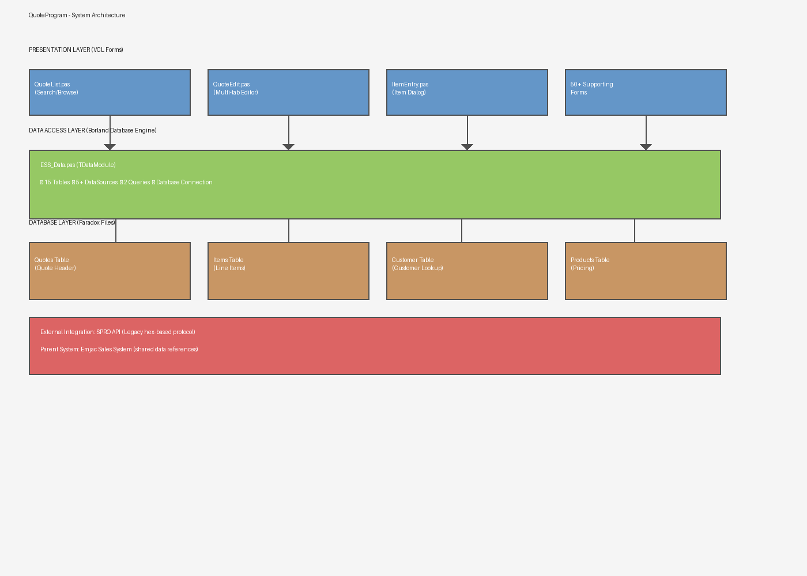
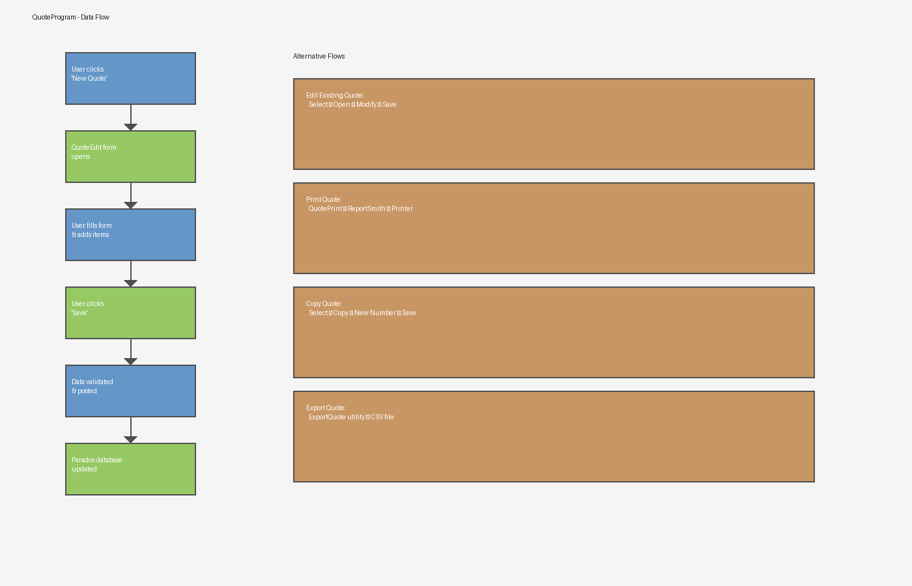
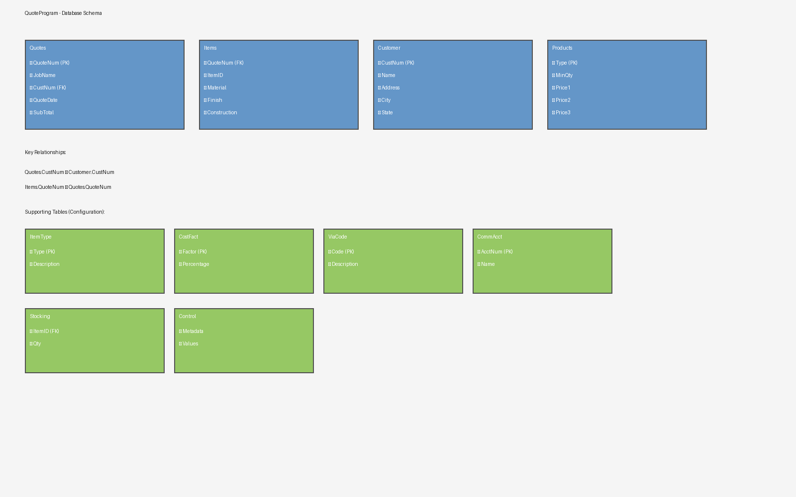
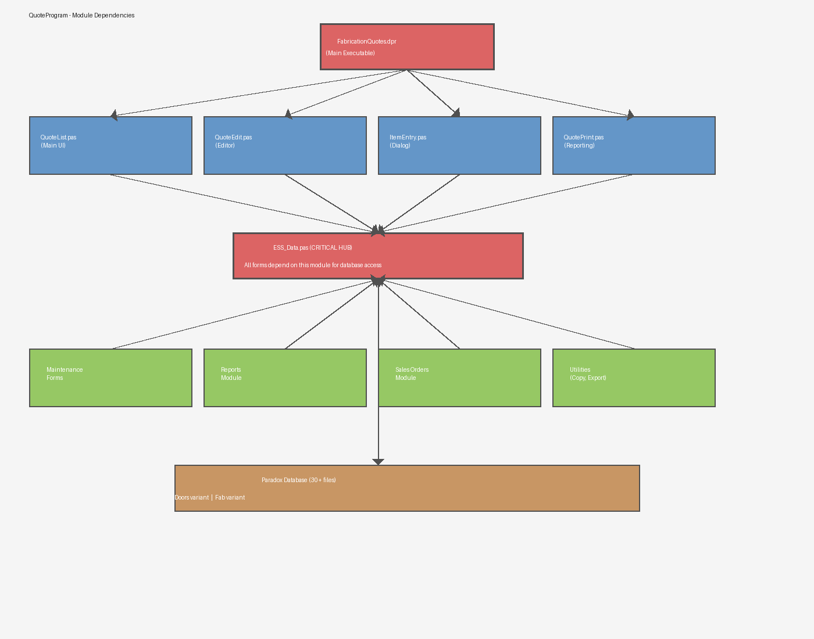

# QuoteProgram - Professional Architecture Diagrams

**Generated:** 2025-12-01
**Format:** PNG (Professional Architecture Diagrams)
**Location:** `/docs/assets/`

> These diagrams provide a visual overview of the QuoteProgram system architecture, data flow, database schema, and module dependencies.

---

## 1. System Architecture



**Description:** Three-tier architecture showing the complete system stack from presentation layer (VCL Forms) through data access layer (ESS_Data module) to database layer (Paradox files).

**Key Components:**
- **Presentation Layer:** 50+ VCL forms including QuoteList, QuoteEdit, ItemEntry, and supporting forms
- **Data Access Layer:** ESS_Data.pas TDataModule with 15 tables, 5+ datasources, 2 queries, and database connection
- **Database Layer:** Paradox database with Quotes, Items, Customer, Products, and supporting tables
- **External Integration:** SPRO API (legacy protocol) and parent Emjac Sales System references

---

## 2. Data Flow Diagram



**Description:** Shows the primary workflow for quote creation and alternative workflows for editing, printing, copying, and exporting quotes.

**Primary Flow:**
1. User clicks "New Quote" button
2. QuoteEdit form opens
3. User fills form and adds items
4. User clicks "Save"
5. Data validated and posted
6. Paradox database updated

**Alternative Flows:**
- **Edit Existing Quote:** Select → Open → Modify → Save
- **Print Quote:** QuotePrint → ReportSmith → Printer
- **Copy Quote:** Select → Copy → New Number → Save
- **Export Quote:** ExportQuote utility → CSV file

---

## 3. Database Schema



**Description:** Visualizes the main database tables and their relationships.

**Core Tables:**
- **Quotes:** Quote header with quote number (PK), job name, customer number (FK), quote date, and subtotal
- **Items:** Quote line items with material, finish, and construction specifications
- **Customer:** Customer master data with company name, address, city, and state
- **Products:** Product pricing tiers (Qty1/Qty2/Qty3) with base and price information

**Supporting Tables:**
- ItemType (item type codes)
- CostFact (cost factor percentages)
- ViaCode (shipping method codes)
- CommAcct (commission accounts)
- Stocking (stock levels)
- Control (system metadata)

**Key Relationships:**
- Quotes.CustNum → Customer.CustNum
- Items.QuoteNum → Quotes.QuoteNum
- Products referenced by material/finish codes

---

## 4. Module Dependencies



**Description:** Shows how all application modules depend on the central ESS_Data module.

**Architecture:**
- **Entry Point:** FabricationQuotes.dpr (main executable)
- **Primary Modules:** QuoteList, QuoteEdit, ItemEntry, QuotePrint
- **Critical Hub:** ESS_Data.pas (all forms depend on this for database access)
- **Supporting Modules:** Maintenance forms, Reports module, Sales Orders module, Utilities (Copy, Export)
- **Storage Layer:** Paradox database (Doors & Fab variants)

**Critical Dependency:** All modules must route through ESS_Data to access database - this is the single point of failure if not properly maintained.

---

## Diagram Usage Guide

### For Presentations
- Use **System Architecture** to explain overall structure
- Use **Data Flow** to walk through user workflows
- Use **Module Dependencies** to show how components connect

### For Development
- Reference **Database Schema** when working with data models
- Reference **Module Dependencies** to understand component relationships
- Reference **System Architecture** to understand integration points

### For Modernization Planning
- Study **System Architecture** to understand migration scope
- Study **Database Schema** to plan data transformation
- Study **Module Dependencies** to identify refactoring opportunities

---

## Key Insights from Diagrams

1. **Layered Architecture:** Clear separation between presentation, data access, and storage
2. **Central Hub Pattern:** ESS_Data module is the critical hub - all access routes through it
3. **Database Relationships:** Well-defined foreign key relationships (Quotes→Customer, Items→Quotes)
4. **Multiple Workflows:** Single system supports 4+ distinct workflows (create, edit, print, copy, export)
5. **External Dependencies:** SPRO API and parent Emjac system are external touch points

---

## Technical Specifications

| Diagram | Dimensions | File Size |
|---------|-----------|-----------|
| system-architecture.png | 1400 x 1000 | 33 KB |
| data-flow.png | 1400 x 900 | 29 KB |
| database-schema.png | 1600 x 1000 | 35 KB |
| module-dependencies.png | 1400 x 1100 | 31 KB |
| **Total** | - | **128 KB** |

---

## How to Use These Diagrams

### In Documentation
```markdown

```

### In Presentations
1. Screenshot individual diagrams for slides
2. Use as reference during architecture discussions
3. Share with stakeholders for system understanding

### In Development
1. Keep diagrams open during code navigation
2. Reference when refactoring modules
3. Use as basis for creating new components

---

## Diagram Generation

These diagrams were generated programmatically using:
- **Tool:** Python PIL (Pillow) for professional rendering
- **Script:** `.claude/scripts/generate_quote_diagrams.py`
- **Color Scheme:** Blue (UI), Green (Data Access), Orange (Database), Red (Critical)
- **Format:** PNG for universal compatibility

### To Regenerate
```bash
cd jac-v1
python .claude/scripts/generate_quote_diagrams.py
```

---

## Next Steps

1. **Review diagrams** with technical team
2. **Update diagrams** if system changes
3. **Use as reference** for modernization planning
4. **Share with stakeholders** for alignment

---

**Generated:** 2025-12-01 | **Status:** Complete | **Location:** `/docs/assets/`
